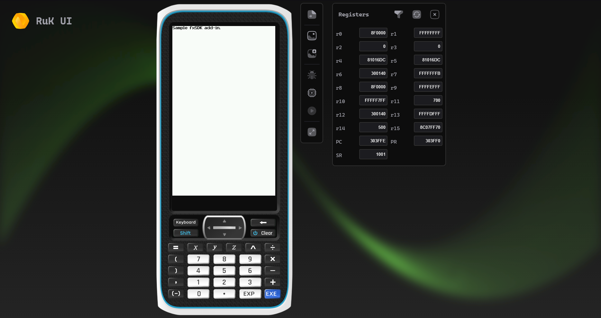
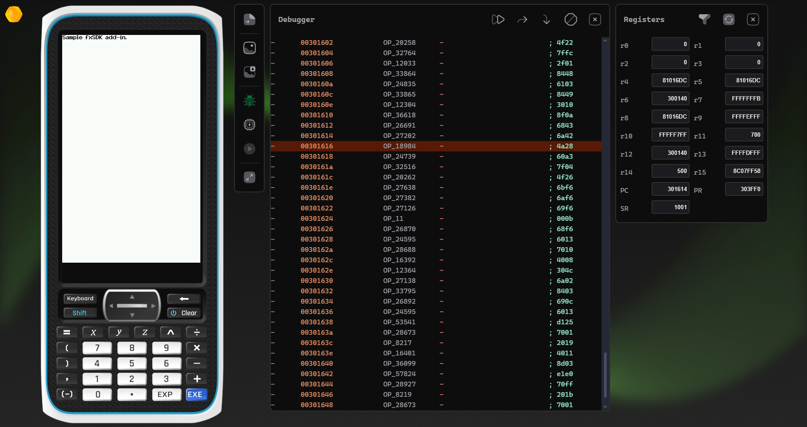

<h1 align="center">
  <br/>
  <br/>
</h1>
<p align="center">A work-in-progress <b>ClassPad Emulator</b>.<br/><br/>

It is based on [casio-emu](https://github.com/Heath123/casio-emu) and will bring some of the [RuK](https://github.com/TheRainbowPhoenix/RuK) UI and features.

It currently runs many add-ins created with [gint](https://gitea.planet-casio.com/Lephenixnoir/gint) quite well.

## Usage

Grab an addin, like [MyAddin.g3a](ebuild/MyAddin.g3a), and select it from the file picker. Then, click "Run" or "Debug".

## Limitations
- This does not attempt to emulate syscalls or the OS yet, so PrizmSDK add-ins will not work
- Add-ins that use the USB driver will not boot
- The code is quite messy and inaccurate sometimes.

## To be done
- Read offset from bin file and dynamically allocate it. For now it's hard-coded ([0x8CFE6000 in interpreter.c](src/interpreter.c) and [entry_point in memory.c](src/memory/memory.c)).
- Support for SDK functions, maybe by building a "stub" os that only provides mocked-up functions and jump tables at given SDK offsets.

### Later
- Disassemble opcodes on debugger
- Stack view
- Write to memory / "hot patching"
- Add "detours" support on debugger

## Building

### For the web

```
C:\Path\To\EMScripten\emsdk\emsdk.bat activate latest
C:\Path\To\EMScripten\emsdk\emsdk_env.bat
mkdir -p ebuild  
cd ebuild
echo "copy the ebuild.zip content in the ebuild folder"
emcmake cmake .. -DUSE_SDL_GUI=ON -DEMSCRIPTEN=ON
emmake make -j4
```

### Locally 

This is not tested, but :

```
mkdir build
# If you want to build the SDL GUI rather than Qt one, add -DUSE_SDL_GUI=ON
# For the Emscripten build, use emcmake and emmake
cmake . -B build
make -C build
./build/calcemu [optional path to g3a]
```

## Screenshots




(Older version)


